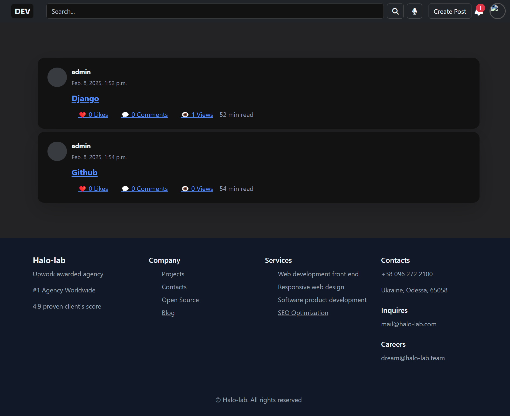
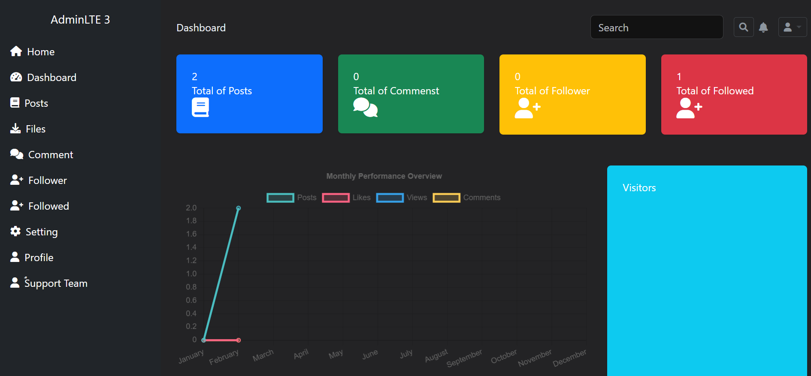
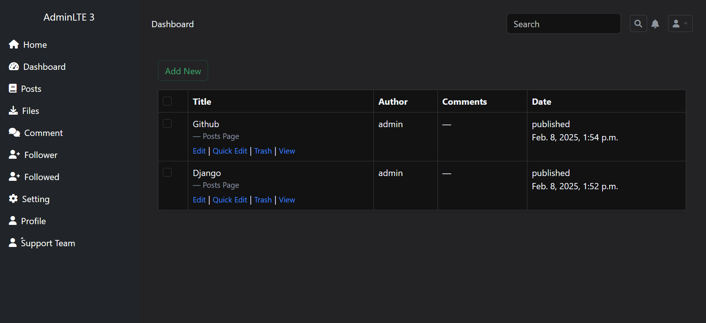
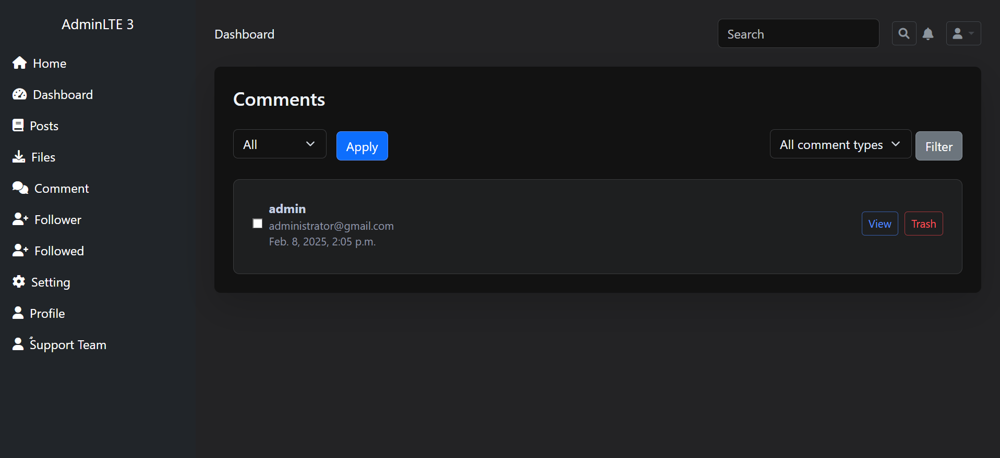
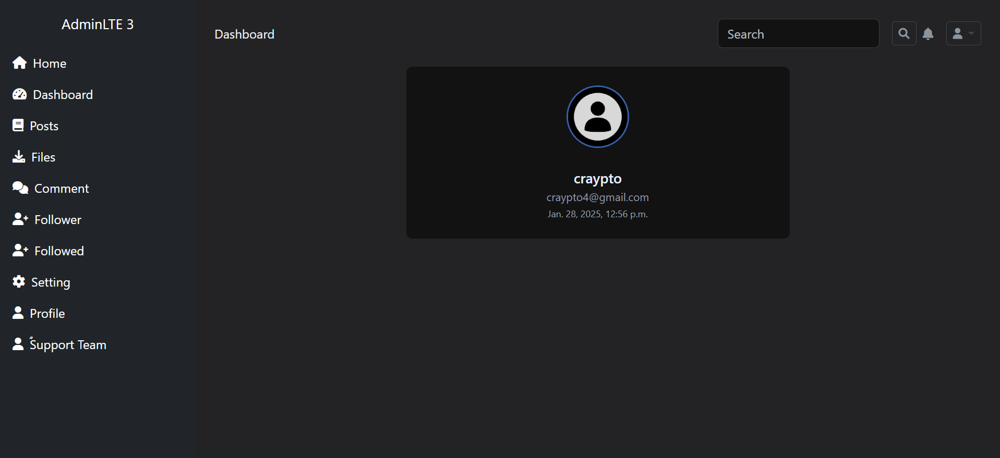
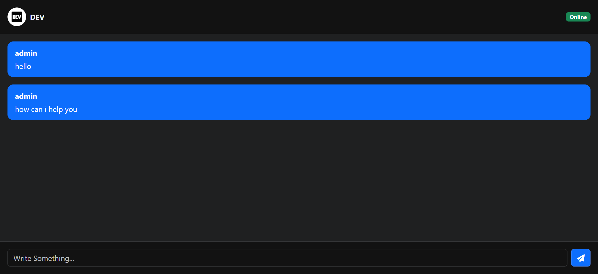

# Weblog Application

This Weblog application is a modern, user-centric platform designed for seamless blogging experiences. With advanced algorithms and robust features, it ensures personalized content delivery and efficient user management.

## Features

### Advanced User Engagement
- **User Authentication:**
  - Secure registration and login system.
  - Personalized dashboards for every user.

- **AI-Powered Content Recommendations:**
  - Utilizes **cosine similarity** and **scikit-learn** algorithms to recommend the most relevant posts to users based on their preferences and interactions.

### Post Management
- **Create and Manage Posts:**
  - Comprehensive tools for creating, editing, and deleting posts.
  - Upload and manage media files directly within posts.

- **Comment Management:**
  - Moderate and delete comments with ease.

### Activity Insights
- **Detailed Reports:**
  - Monitor weblog activities such as post statistics, user engagement, and performance metrics.

### Social Connectivity
- **Follower and Followed Management:**
  - Efficiently manage followers and followed users.
  - View, add, or remove connections in an intuitive interface.

### Real-Time Communication
- **Chat Support:**
  - Integrated live chat support to enhance user interaction and address queries in real-time.

---

## Screenshots

1. **Homepage:**
   

2. **User Dashboard:**
   

3. **Manage Posts:**
   

4. **Manage Comments:**
   

5. **Follower Management:**
   

6. **Chat Support:**
   

---

## Technical Stack

### Backend
- **Django:** Robust and scalable web framework.
- **scikit-learn:** For implementing cosine similarity algorithms and machine learning models.

### Frontend
- **HTML/CSS/JavaScript:** Interactive and responsive UI.
- **Bootstrap:** For a modern and clean design.

### Database
- **sqlite:** For storing user and post data efficiently.

---

## Installation and Setup

1. Clone the repository:
   ```bash
   git clone https://github.com/Esmat434/BlogNest.git
   ```

2. Navigate to the project directory:
   ```bash
   cd BlogNest
   ```

3. Install dependencies:
   ```bash
   pip install -r requirements.txt
   ```

4. Set up the database:
   ```bash
   python manage.py migrate
   ```

5. Start the development server:
   ```bash
   python manage.py runserver
   ```

6. Open the application in your browser at:
   ```
   http://127.0.0.1:8000
   ```

---

## Contribution Guidelines

We welcome contributions from the community. Here’s how you can get involved:

1. Fork the repository.
2. Create a new branch:
   ```bash
   git checkout -b feature-branch-name
   ```
3. Commit your changes:
   ```bash
   git commit -m "Add a meaningful message"
   ```
4. Push the branch:
   ```bash
   git push origin feature-branch-name
   ```
5. Submit a pull request.

---

## License
This project is licensed under the MIT License. See the [LICENSE](./LICENSE) file for details.

---

## Contact
For any questions or feedback, please reach out:
- Email: [hadelesmatullah@gmail.com](mailto:hadelesmatullah@gmail.com)
- GitHub: [Your GitHub Profile](https://github.com/Esmat434)